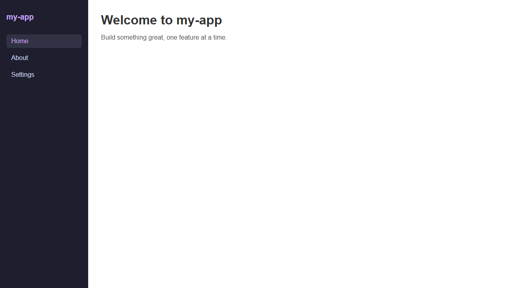

# my-app — Product Documentation

This folder contains product and API documentation for **my-app**.

---

## Contents

| File / Folder       | Description                              |
|---------------------|------------------------------------------|
| `README.md`         | This file — documentation index          |
| `features/`         | Per-feature user-facing documentation    |
| `api/`              | API reference (endpoints, payloads)      |
| `architecture/`     | System design and architecture decisions |

---

## How Documentation Is Updated

Documentation is maintained as part of the automated E2E development workflow
defined in `.claude/skills/e2e-dev-flow/SKILL.md`.

Every code change that affects user-facing behaviour or the public API
**must** be accompanied by a docs update in the same Pull Request.

---

## Features

### Home Page (`MYAPP-1`)

The home page is served at `/` by the Node.js HTTP server in `src/index.js`.

| Element   | Content                                        |
|-----------|------------------------------------------------|
| `<title>` | `my-app`                                       |
| `<h1>`    | `Welcome to my-app`                            |
| `
`     | `Build something great, one feature at a time.` |

**Tests:** `tests/home.spec.js` — 4 Playwright tests covering title, heading, tagline, and non-empty body.

**Screenshot:**

### Settings Page (`MYAPP-4`)

The Settings page is served at `/settings` by the Node.js HTTP server in `src/index.js`.

| Element         | Content                                              |
|-----------------|------------------------------------------------------|
| `<title>`       | `Settings — my-app`                                  |
| `<h1>`          | `Settings`                                           |
| `
`           | `Manage your application preferences below.`         |
| Theme selector  | `<select id="theme">` — Light / Dark / System        |
| Notifications   | `<input type="checkbox" id="notifications">` checked |
| Back link       | `← Back to Home` → navigates to `/`                 |

**Tests:** `tests/home.spec.js` — 5 Playwright tests covering title, heading, theme selector, notifications toggle, and back-link navigation.

---

### Left Navigation Bar (`MYAPP-3`)

A persistent left-side navigation panel added to all pages.

| Element        | Content / Behaviour                          |
|----------------|----------------------------------------------|
| Brand label    | `my-app` (styled in purple)                  |
| Home link      | `/` — marked `aria-current="page"` when active |
| About link     | `/about`                                     |

**Tests:** `tests/home.spec.js` — 3 Playwright tests covering visibility, active Home link, and About link href.

---

## Style Guide

- Write in clear, plain English.
- Use present tense ("The button **saves** the form").
- One concept per page.
- Include code examples where relevant.
- Keep line length ≤ 100 characters.
